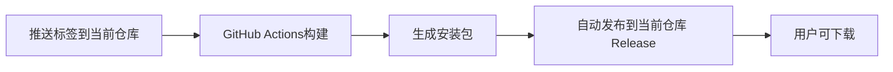

# 当前仓库自动发布设置指南

这个指南将帮你设置在当前仓库自动发布 Release 的功能。

## 1. 仓库准备

1. 确保当前仓库已启用 GitHub Actions
2. 确保你对当前仓库有写入权限

## 2. 配置工作流

项目已经使用 `GITHUB_TOKEN` 在当前仓库创建 Release，不再需要 `PUBLIC_REPO_TOKEN`。

检查 `.github/workflows/release-to-public.yml` 中发布步骤应为：

```yaml
env:
  GITHUB_TOKEN: ${{ secrets.GITHUB_TOKEN }}
```

## 3. 测试发布

创建并推送标签来测试：

```bash
git tag v1.0.0
git push origin v1.0.0
```

## 工作流程



## 最终效果

- 📦 **当前仓库**: 同时保存源代码和 Release 文件
- 🤖 **自动化**: 推送标签后自动构建并发布
- 📱 **易分享**: 开源后可直接分享当前仓库链接

## 示例仓库结构

```
auto-cursor-vip/
├── README.md (安装说明和下载链接)
└── Releases/
    ├── v1.0.0/
    │   ├── auto-cursor_x86_64.dmg
    │   ├── auto-cursor_aarch64.dmg
    │   └── auto-cursor.msi
    └── v1.0.1/
        ├── ...
```

## 常见问题

### Q: PAT权限不足？
A: 当前方案不再依赖 PAT；请确认仓库 Actions 权限为可写（`contents: write`）。

### Q: 工作流失败？
A: 检查：
1. 标签格式是否为 `v*`（例如 `v1.0.0`）
2. 工作流 `permissions` 是否包含 `contents: write`
3. 是否存在重复工作流同时创建同一 Release

### Q: 如何自定义Release说明？
A: 编辑工作流文件中的 `body:` 部分。
