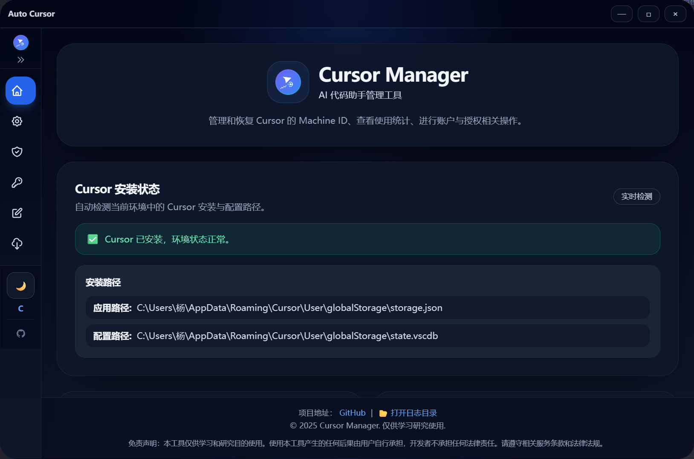

# Auto Cursor

一个基于 `Tauri 2 + React + TypeScript + Rust` 的跨平台桌面工具，聚焦 Cursor 相关账号管理、Token 管理、Machine ID 备份/恢复与自动化流程。


## 截图预览

### 黑暗模式



### 白天模式


## 主要特性

- Cursor 环境检测：自动识别安装状态与关键路径。
- Cursor、Codex-GPT账户CDP协议浏览器自动注册。
- Machine ID 管理：备份、恢复、重置与相关诊断能力。
- Token / 账户管理：批量导入导出、快速切换、分组筛选、状态查看、无感换号。
- Codex Token 文件管理：列表、复制、预览、打开对应目录。
- 授权与订阅信息：拉取授权状态、订阅状态、用量信息。
- 自动化流程：支持验证码流程、手动输入兜底等场景。
- 多主题 UI：支持浅色/深色模式，适配桌面窗口体验。

## 技术栈

- 前端：`React 19`、`TypeScript`、`Vite`、`Tailwind CSS`、`Zustand`
- 桌面：`Tauri 2`
- 后端：`Rust`、`Tokio`、`Reqwest`、`Rusqlite`

## 环境要求

- Node.js `18+`（推荐 `20+`）
- `pnpm`（也可使用 npm，但文档以 pnpm 为例）
- Rust 工具链（建议 stable 最新版）
- 已安装 Cursor 客户端

## 快速开始

### 1) 安装依赖

```bash
pnpm install
```

### 2) 启动开发环境

```bash
pnpm tauri dev
```

### 3) 构建桌面应用

```bash
pnpm tauri:build
```

## 自动注册采用的py的脚本打包后使用的

### 运行方式,在python_scripts目录下

```bash
python3 -m venv venv && ./venv/bin/pip install -U pip && ./venv/bin/pip install -r requirements_minimal.txt
```

- `python ./build_executable.py`

## 常用脚本

- `pnpm dev`：仅启动前端 Vite 开发服务器
- `pnpm tauri dev`：启动 Tauri 开发模式（前后端联调）
- `pnpm build`：构建前端产物
- `pnpm tauri:build`：构建桌面安装包

## 项目结构

```text
auto-cursor/
├─ src/                         # React 前端源码
├─ src-tauri/                   # Tauri + Rust 后端
│  ├─ src/
│  │  ├─ lib.rs                 # Tauri 命令入口与核心逻辑
│  │  └─ cursor_backup.rs       # 备份/目录打开等能力
│  ├─ Cargo.toml
│  └─ tauri.conf.json
├─ scripts/                     # 构建/发布脚本
├─ README.md
└─ package.json
```

## 功能说明（简版）

### Token / 账户管理

- 支持账户分组、筛选、排序、批量操作。
- 支持从剪贴板导入/导出账户数据。
- 支持自动获取 Token 与验证码流程兜底（手动输入验证码）。

### Machine ID 管理

- 支持读取、备份、恢复与重置。
- 在关键修改前会尽量进行备份，降低误操作风险。

### Codex 账户列表

- 支持查看 token 文件列表。
- 支持复制内容、弹窗预览、打开对应文件夹。

## 安全与隐私

- 工具仅处理本地文件与本地系统环境相关配置。
- 默认不上传用户本地配置内容到远端服务。
- 某些操作可能需要更高系统权限（例如 Windows 注册表相关场景）。

> 使用本工具前请先备份重要数据，风险自担。

## FAQ

### 为什么某些操作需要管理员权限？

部分系统级修改（如注册表、系统路径写入）需要更高权限才能生效。

### 出现验证码自动获取失败怎么办？

前端已提供手动输入验证码流程，可在提示后直接输入继续。

### 支持哪些平台？

理论支持 Windows / macOS / Linux（以实际构建与环境依赖为准）。

## 贡献指南

欢迎提交 PR 与 Issue。建议流程：

1. Fork 并新建分支：`feat/xxx` 或 `fix/xxx`
2. 提交清晰的 commit message
3. 提交 PR，说明变更背景、方案与测试结果

## 社区交流
论坛：[linux.do](https://linux.do)

## 开源许可证

`MIT License`

<h1>📩 Disclaimer | 免责声明</h1>
本工具仅供学习和研究使用，使用本工具所产生的任何后果由使用者自行承担。

This tool is only for learning and research purposes, and any consequences arising from the use of this tool are borne by the user.
